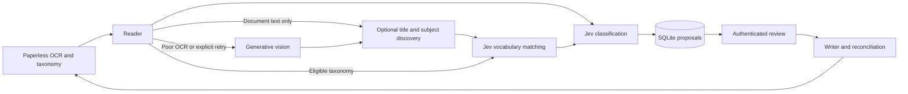

# Architecture

Python 3.12, FastAPI/Jinja with plain browser JavaScript, SQLite, HTTPX, the official TypeSafe SDK, and the OpenAI Responses API. One worker thread processes jobs sequentially; a filesystem lock prevents two application workers from owning the same data directory. No broker or frontend build is needed.

## Providers and data

Paperless IDs identify existing taxonomy entries. Jev receives document text and tag/type definitions, without the current title or target labels. The type question is a Choice including `unknown`; each existing or newly suggested tag has its own Noul question. Missing answers, invalid ranges, nonfinite probabilities, unexpected options, and broken distributions fail closed.

A generative call optionally proposes a title and up to six central filing subjects. This call receives document text only, with no existing taxonomy to constrain discovery. It runs whenever enrichment is enabled, independently of existing-tag scores. A rare subject is permitted even when it is the first example in the archive. Suggestions require supporting quotes present in the supplied text, normalized names, and no normalized-name duplicates or operational names.

After discovery, exact normalized names are matched deterministically. A separate Jev Choice per remaining subject compares its name and definition with the eligible taxonomy, including an explicit distinct/uncertain option. The instructions require equivalent meanings and scopes: a broader or narrower topic is not a synonym. These matching decisions are suggestions, not correctness guarantees. All subjects remain visible in review, including matches, and each receives an independent Jev Noul relevance score against the document alongside the existing tags. Matching supports up to 254 eligible tags plus the distinct option and uses the same serialized-request limit as classification; oversized requests fail visibly.

Reviewers can select a subject to reuse an existing ID, override a suggested match, or rename and create a new tag. Subject selections start unchecked; an existing tag can still be preselected independently by its existing-tag relevance score. Names are editable labels for the discovered subject; scores still refer to that original subject. At most three new tags can be created per approval. The approved names, evidence, definitions, and existing IDs are stored separately from the original proposal. New tags enter the live taxonomy for subsequent classifications; reusing a tag never replaces its local definition.

OCR with fewer than 60 alphanumeric characters, or a high replacement-character ratio, triggers vision when enabled. When enrichment is enabled, its readability assessment also triggers vision for substantially garbled text that passes those simple checks. If vision is disabled, unreadable text becomes an explicit review error. Jev-only mode has the inexpensive text heuristic; a reviewer can explicitly request vision for other poor scans. PDFs and multipage images are rendered locally and all pages are supplied in order. Limits: eight pages, 20 MiB downloaded originals, 60,000 text characters, and a conservative 110,000-byte serialized Jev request. Oversized inputs fail visibly; input is never silently truncated. The UI stores/shows at most 8,000 characters of source excerpt.

Vision and enrichment use structured output with `store=False`. The provider's completion status is checked before the SDK parses structured text: an unfinished JSON object must not hide a content-filter stop or output limit. Filtered/refused responses, output limits, malformed results, and timeouts have distinct safe errors. Partial or refused results never reach Jev or the writer, and they are not automatically replayed. Document content is untrusted data and receives no tools. Raw documents, credentials, and upstream error bodies are not logged.

## State and proposals

SQLite contains jobs, cached inference, settings, sessions, tag definitions, intake fingerprints, and operation journals. Each proposal records its input fingerprint, taxonomy snapshot, before metadata, models, usage, latency, source, relevance scores, vocabulary-match answers, and cache provenance. Discovery, matching, vision, and classification usage have separate stage labels. Reviewer approval and actual after metadata are distinct records within the job. The operation table stores write intent before network calls and confirmed results afterward; completed results are not overwritten during reconciliation.

Every new proposal gets a fresh revision, including cache reuse. A digest of the proposal is sent with approval, captured when the browser opens the review rather than taken from later polling. SQLite checks that digest and the review status within the transaction that queues the approval. Older stored proposals receive a digest when read and can be reviewed without migration. Previously persisted approvals lacking a revision remain recoverable because approved jobs cannot be reclassified in place. All nonterminal jobs are returned independently of the latest 200 terminal history entries.

Job cards and detail headings use the existing Paperless title even before a proposal exists. The worker retains the fetched title before calling providers; the state endpoint resolves names for older failed or queued jobs. These read-only lookups are cached for one minute, including temporary failures, so UI polling does not repeatedly fetch documents. A missing title or unavailable Paperless lookup falls back to the document ID. No inference or document write is needed to display a name.

Cache identity includes Paperless instance, document ID/text/checksum, eligible taxonomy and definitions, requested models, options, and prompt version. Approval checks use fresh Paperless state. Cached usage describes the original call; cache reuse makes no new inference call. Model scores are not measured accuracy.

Sessions contain only random opaque IDs in browser cookies, with hashes and CSRF tokens stored server-side. Password login verifies through Paperless and admits only the account whose API token matches this app's configured token. Direct token login is also supported. All mutations check both exact origin and CSRF (login checks origin); failed login attempts are rate limited per client address.

## Apply and recovery

Only reviewed jobs enter the writer. It re-fetches the document and taxonomy, checks text and label changes, and rejects conflicting title/type edits. Title and type are patched independently of tags. Tags use Paperless's additive bulk `modify_tags` operation with an empty removal set; asynchronous acceptance is followed by polling the actual document.

New tags are matched by normalized live name before creation. Once a tag ID is confirmed, recovery uses that recorded ID and rejects a subsequent rename or deletion instead of creating a replacement. A timeout before confirmation can be reconciled by finding the normalized name; if no match exists, the uncertain creation requires inspection and fresh review rather than another create attempt. Multiple normalized matches require manual resolution. Definitions are initialized only for confirmed newly created tags, using insert-if-absent so later curated definitions are preserved. Recovered ambiguous creations do not overwrite definitions.

Before further writes, completed metadata and tag-addition operations are checked against current Paperless state. A later change, including reverting a title to its original value, is a conflict. Unconfirmed operations still check whether the desired state already exists before retrying. Original files, OCR, correspondents, and existing tags are never replaced.

A restart turns interrupted inference into an explicit retry and interrupted application into an explicit reconciliation task. Reconciliation revalidates approved intent and current state. A failed proposal can be closed without undoing completed changes; this retains the journal and observed metadata, permitting a fresh classification. Late asynchronous additions can still finish. There is no transactional write across Paperless endpoints and no atomic compare-and-swap against another writer; avoid concurrent metadata automation for the same documents.

Queue removal uses conditional status transitions into history, preserving proposals and approvals. Waiting writes can be canceled only before the writer claims them; active writes cannot be dismissed. Inference checks the current job before and after provider calls, so a removed job stops at the next boundary and cannot overwrite a newly queued job or return to review. A provider request already in progress is not forcibly interrupted. Removing an application error uses the existing close-without-undo flow and preserves observed metadata.

Intake is disabled by default. Enabled intake polls a selected tag once a minute, enqueues at most ten new documents per poll, and caps the processing backlog at 50. Removing the queue tag prevents later processing/application. The tag is retained after completion, and persisted input fingerprints prevent loops. A paused worker finishes its current operation but schedules/processes no new work.

## Deployment

The service runs on docker-server using Podman Quadlet, `services.network`, a Caddy hostname, and UID 10001 with a private local data volume. `home-ansible` owns infrastructure and secret-file permissions. Health checks only examine the database and worker; they never invoke a paid provider. See [operations](operations.md).
