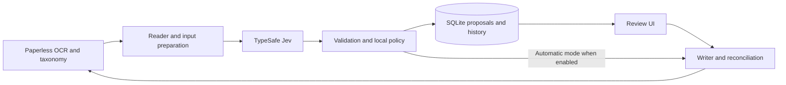

# Proposed architecture

This is a design, not a description of implemented software.

## Components and data flow

Planned stack: Python 3.12+, the official `typesafe-sdk`, HTTPX for Paperless,
Pydantic for internal contracts, SQLite for durable state, and FastAPI with Jinja
and HTMX for the review UI. Start with a CLI and introduce web dependencies when
the review workflow is ready. No separate broker or frontend build is required.

Keep these responsibilities separate: Paperless reads, question construction,
provider calls, decision policy, persistence, and Paperless writes. The classifier
returns a proposal; only the writer can mutate Paperless.

## Input and taxonomy

Fetch OCR content and the permitted document types and tags from Paperless. Keep
numeric Paperless IDs as identity and display names as labels. Store optional
human-written descriptions and exclusions by ID in local configuration. Snapshot
names and descriptions so renames invalidate old decisions.

Use OCR text as the initial model input. Keep document IDs and current metadata
in local orchestration; existing target labels must not leak into the model as
the answer. Evaluate adding original filenames separately before using them as
features. Documents containing instructions are still document data, never a
source of permission to call tools or change policy.

Exclude workflow/control tags from candidates. An empty document-type taxonomy
disables that question; an empty tag taxonomy disables tag questions. If there
are no classification targets, return a configuration status without a provider call.

Read all selected taxonomy pages. Initially evaluate every allowed tag so a
candidate search cannot silently exclude a relevant label. If OCR plus taxonomy
exceeds the verified model budget, return `input_too_large` for review. Do not
silently truncate. Chunking, candidate retrieval, and their recall evaluation are
later work. Missing OCR similarly returns `ocr_missing` without a paid call.

## Typed decisions

| Decision | Primitive | Interpretation |
| --- | --- | --- |
| Document type | Choice | One existing type plus an explicit `unknown` option. |
| Each allowed tag | Noul | Independent probability that the tag applies. |

Batch questions sharing the document state in one request. Put complete label
definitions in question instructions/criteria; question IDs alone do not instruct
the model. Stable option keys such as `type_12` map back to Paperless IDs.

Noul has no separate confidence field. Choice includes both option probabilities
and a distribution-derived confidence statistic. Keep those distinct; a confidence
value is not an observed accuracy rate. See [primitives](https://docs.typesafe.ai/primitives)
and [confidence](https://docs.typesafe.ai/confidence).

For tags, use separate configured boundaries for proposing inclusion and
automatic inclusion; very uncertain tags go to review. Low probability means
"do not add," never "remove an existing tag." For types, use the selected
probability and separation from competing options, plus the unknown result, in
the versioned policy. Thresholds are calibrated by field and, when data permits,
by category. No arbitrary numeric threshold ships as a proven default.

An unknown type can have high probability: that is an abstention, not a type to
create. Validate every result against the exact request snapshot. Missing,
non-finite, malformed, or unmapped answers fail validation. Local policy records
explicit reasons such as `existing_type_conflict` and `below_auto_threshold`.

## Proposal contract and persistence

A proposal has its own schema version and contains:

- Paperless instance identity and document ID.
- Hashes of OCR input and taxonomy; current metadata snapshot.
- Model requested/reported, SDK version, question version, and policy version.
- Typed model results, proposed field changes, and per-field dispositions.
- Usage, elapsed time, timestamps, and any provider request identifier returned.
- Review decision and actual write outcomes stored separately from predictions.

The [example](../examples/classification.json) illustrates the user-visible
decision shape; it is not an API response or the complete persistence schema.

Use SQLite tables for jobs, runs, proposals, reviews, and write operations.
Separate the inference cache key (instance, document ID, OCR hash, taxonomy and
question versions, model identifier) from policy evaluation and current metadata.
This lets thresholds change without paying for identical inference again.
Changing OCR, taxonomy, questions, or model produces a fresh evaluation. An
explicit re-evaluate action bypasses cache when a moving model alias is used.

Workers lease jobs transactionally with expiry/recovery. Store review rejections
against a decision version so the poller does not immediately re-propose the same
rejected change. Review-required and terminal-error states wait for a meaningful
input change or explicit retry. Transient errors retry with bounded backoff.

## Applying metadata

Paperless exposes token-authenticated, versioned APIs. Read document and taxonomy
endpoints with pagination, use document updates for types, and prefer additive
tag operations. Bulk changes are asynchronous and need completion verification.
Verify these contracts against the installed server before implementing writes.
[Paperless API reference](https://github.com/paperless-ngx/paperless-ngx/blob/main/docs/api.md)

The writer re-fetches the document and relevant taxonomy immediately before apply.
Changed input, changed policy, or incompatible metadata makes the proposal stale.
Add tags without replacing the entire tag list. Automatically assign a type only
when it is still empty; an explicitly reviewed replacement carries the expected
previous value. Serialize this application's writes per document.

Do not assume Paperless offers atomic conditional updates: verify its installed
schema. A read-before-write check alone cannot eliminate races with other clients.
If no conditional operation exists, use one automated owner for type assignments,
verify afterward, and document the remaining user-edit race. Defer contested
updates instead of repeatedly overwriting them.

Persist intent before sending a write. A timeout means unknown outcome: read
current state and inspect any known task before retrying. Track tag additions and
type changes separately so a partial failure can resume without repeating a
completed operation. Queue-marker removal is a final, verified operation, and
only applies to the dedicated opt-in queue marker after all decisions are resolved.

Record the exact before/after delta. Reversal is a new reviewed proposal with
fresh state checks, not a blanket restore of an old document. If attribution is
uncertain, retain the history and request review of the conflicting fields.

## Deployment and existing workflows

Run the app on `docker-server`; build and evaluate from scratch. Keep infrastructure
configuration in `home-ansible`, not as copied inventory in this repository.
Use a private Caddy route, a persistent local database volume, and injected secrets.
No dependency on Spark is required for the TypeSafe-backed first release.

Start with explicit document IDs and read-only proposals. A later dedicated queue
tag isolates the classifier from Paperless-GPT and n8n. In the initial pilot,
leave `needs-tags` unchanged. Before enabling writes, decide which service owns
each field for the selected documents and verify Paperless update workflows do
not trigger recursive processing. OCR must be ready before a document is queued.

## Data and operational boundaries

OCR selected for classification and taxonomy descriptions leave the homelab for
TypeSafe inference. The setup screen should show that data flow. Do not transfer
documents during installation or an ordinary health check. Local inference is a
possible later adapter, not a property of this backend.

Keep credentials, private fixtures, OCR exports, run databases, and evaluation
outputs out of git. Ordinary logs contain IDs, status, usage, and timing, not
document bodies. Store minimal audit metadata and fetch review text from Paperless
on demand. Authenticate the UI; escape rendered document text and protect
state-changing routes. Allowlist metadata operations and never let document text
select endpoints, credentials, or commands.
